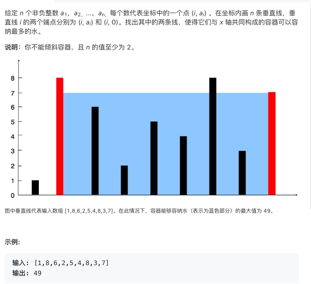
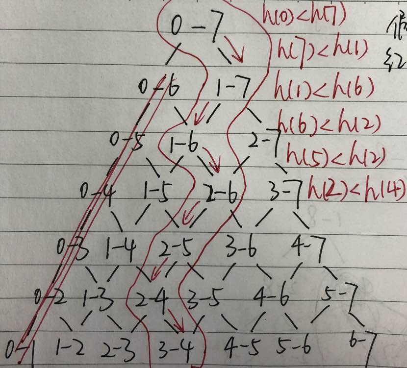

### 涉及知识点

### Quiz


### Algorithm

#### 暴力法

Time: O(n^2), Space: O(1)
```java
public class Solution {
    public int maxArea(int[] height) {
        int maxarea = 0;
        for (int i = 0; i < height.length; i++)
            for (int j = i + 1; j < height.length; j++)
                maxarea = Math.max(maxarea, Math.min(height[i], height[j]) * (j - i));
        return maxarea;
    }
}
```

#### 双指针法

这种方法背后的思路在于，两线段之间形成的区域总是会受到其中较短那条长度的限制。此外，两线段距离越远，
得到的面积就越大。

我们在由线段长度构成的数组中使用两个指针，一个放在开始，一个置于末尾。 此外，我们会使用变量 maxarea 
来持续存储到目前为止所获得的最大面积。 在每一步中，我们会找出指针所指向的两条线段形成的区域，更新 
maxarea，并将指向较短线段的指针向较长线段那端移动一步。

查看下面的例子将有助于你更好地理解该算法：

这种方法如何工作？

最初我们考虑由最外围两条线段构成的区域。现在，为了使面积最大化，我们需要考虑更长的两条线段之间的区
域。如果我们试图将指向较长线段的指针向内侧移动，矩形区域的面积将受限于较短的线段而不会获得任何增加。
但是，在同样的条件下，移动指向较短线段的指针尽管造成了矩形宽度的减小，但却可能会有助于面积的增大。
因为移动较短线段的指针会得到一条相对较长的线段，这可以克服由宽度减小而引起的面积减小。


Time: O(n), Space: O(1)
```java
public class Solution {
    public int maxArea(int[] height) {
        int maxarea = 0, l = 0, r = height.length - 1;
        while (l < r) {
            maxarea = Math.max(maxarea, Math.min(height[l], height[r]) * (r - l));
            if (height[l] < height[r])
                l++;
            else
                r--;
        }
        return maxarea;
    }
}

```

与许多小伙伴一样，我很疑惑为什么双指针法不会错过最优解。 我百思不得其解，直到我画了一棵树： 

这棵树是遍历所有可能情况，红笔圈出来的部分是双指针法走的路径。

以0-7走到1-7这一步为例，解释为什么放弃0-6这一分支：

用h(i)表示第i条线段的高度，S(ij)表示第i条线段和第j条线段圈起来的面积。

```
可知 h(0) < h(7)，从而S(07) = h(0) * 7。

有S(06) = min(h(0), h(6)) * 6。
当h(0) <= h(6)，有S(06) = h(0) * 6；
当h(0) > h(6)，有S(06) = h(6) * 6，S(06) < h(0) * 6。

由此可知，S(06)必然小于S(07)。
```

把每一棵子树按照同样的方法分析，很容易可以知道，双指针法走的路径包含了最大面积。

### Code

```java

```