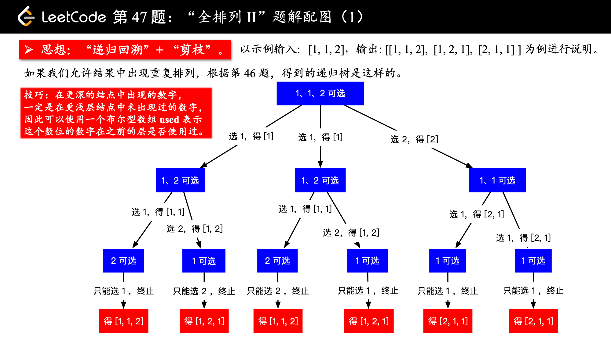
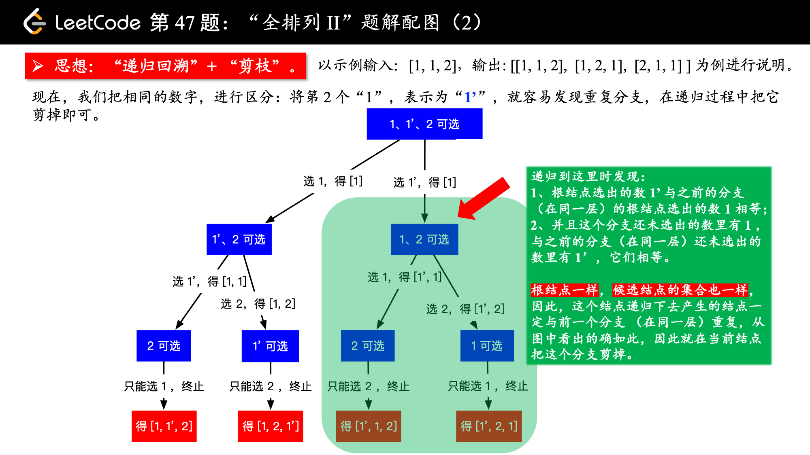
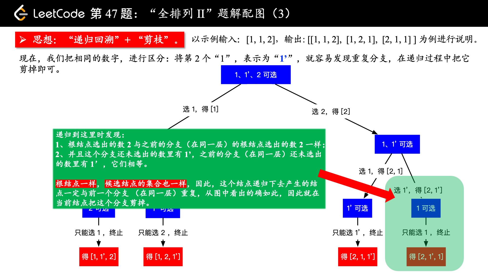
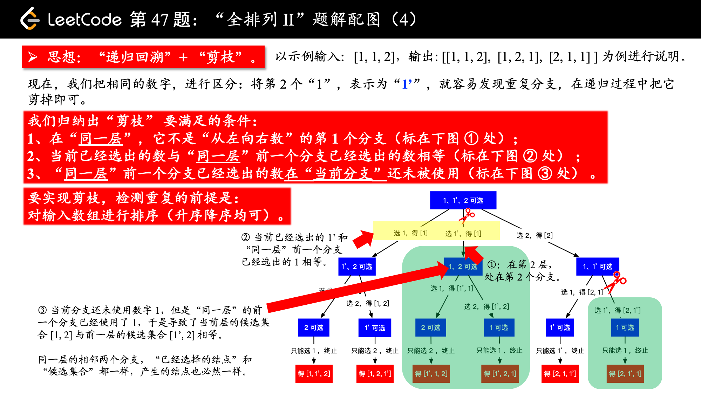

给定一个可包含重复数字的序列，返回所有不重复的全排列。

示例:
```
输入: [1,1,2]
输出:
[
  [1,1,2],
  [1,2,1],
  [2,1,1]
]
```


思路分析：

这一题是在 [「力扣」第 46 题：全排列](https://leetcode-cn.com/problems/permutations/) 的基础上增加
了“序列中的元素可重复”这一条件。因此使用的方法还是“回溯算法”，只不过在构建递归树的过程中需要剪枝。

在第 46 题中，如果没有重复元素画出的树形图是这样的。


我下面的描述基于我写的 [「力扣」第 46 题：全排列的题解 《回溯算法（Python 代码、Java 代码）](https://leetcode-cn.com/problems/permutations/solution/hui-su-suan-fa-python-dai-ma-java-dai-ma-by-liweiw/) 。

下面这段话是解决有重复元素的序列的排列问题的关键：

当数组中，有了重复元素的时候，其实也不难，我们可以先把数组排个序，这样在递归的过程中就可以很容易发现
重复的元素。当发现重复元素的时候，让这一个分支跳过，就达到了“剪枝”的效果，重复的排列就不会出现在结果
集中。

请看下图，我们把排序以后的数组，就当做它没有重复元素的话，还按照之前的回溯方法，也很容易看出重复的分
支，把它剪去即可。

（温馨提示：下面的幻灯片中，有几页上有较多的文字，可能需要您停留一下，可以点击右下角的后退 “|◀” 或
者前进 “▶|” 按钮控制幻灯片的播放。）









以下代码根据我在「力扣」第 46 题：全排列 II 中的题解（上文有给出链接）中的示例代码修改而来，具体修改
的地方，在下面代码的注释中有说明。

基于第 46 题，做 2 处修改即可：

1、在开始回溯算法之前，对数组进行一次排序操作，这是上面多次提到的；

2、在进入一个新的分支之前，看一看这个数是不是和之前的数一样，**如果这个数和之前的数一样，并且之前的数
还未使用过，那接下来如果走这个分支，就会使用到之前那个和当前一样的数，就会发生重复，此时分支和之前的
分支一模一样。（这句话特别关键，可以停下来多看两遍，再看一看上面画的那张图）**。


```java
import java.util.ArrayList;
import java.util.Arrays;
import java.util.List;
import java.util.Stack;

public class Solution {

    private List<List<Integer>> res = new ArrayList<>();
    private boolean[] used;

    private void findPermuteUnique(int[] nums, int depth, Stack<Integer> stack) {
        if (depth == nums.length) {
            res.add(new ArrayList<>(stack));
            return;
        }
        for (int i = 0; i < nums.length; i++) {
            if (!used[i]) {
                // 修改 2：因为排序以后重复的数一定不会出现在开始，故 i > 0
                // 和之前的数相等，并且之前的数还未使用过，只有出现这种情况，才会出现相同分支
                // 这种情况跳过即可
                if (i > 0 && nums[i] == nums[i - 1] && !used[i - 1]) {
                    continue;
                }
                used[i] = true;
                stack.add(nums[i]);
                findPermuteUnique(nums, depth + 1, stack);
                stack.pop();
                used[i] = false;
            }
        }
    }

    public List<List<Integer>> permuteUnique(int[] nums) {
        int len = nums.length;
        if (len == 0) {
            return res;
        }
        // 修改 1：首先排序，之后才有可能发现重复分支
        Arrays.sort(nums);
        used = new boolean[len];
        findPermuteUnique(nums, 0, new Stack<>());
        return res;
    }

    public static void main(String[] args) {
        int[] nums = {1, 1, 2};
        Solution solution = new Solution();
        List<List<Integer>> permuteUnique = solution.permuteUnique(nums);
        System.out.println(permuteUnique);
    }
}

```